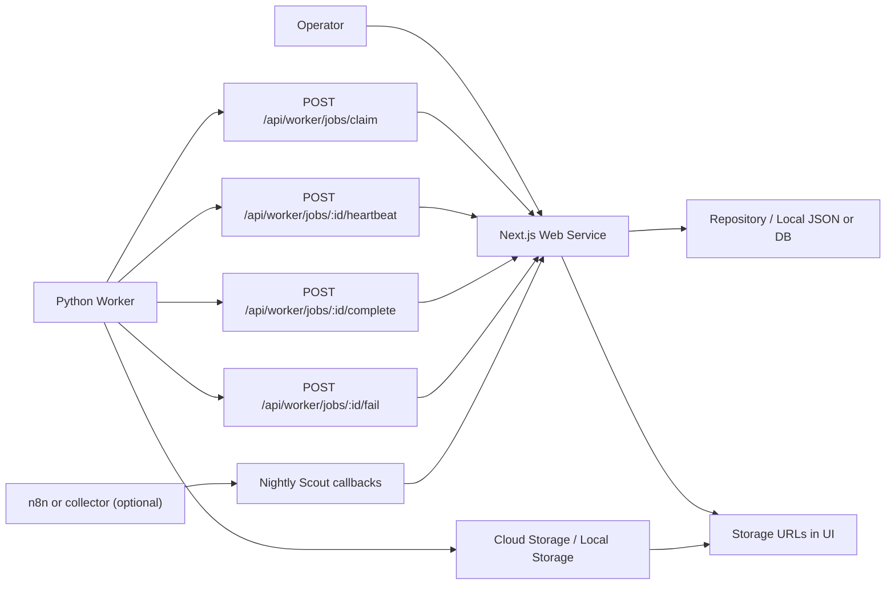

# 03 Architecture Design

## Current Architecture

## Components

### Web Service

The Next.js app is the control plane. It owns settings, queue selection, worker job creation, job status, run logs, and manual review.

### Python Worker

The Python Worker is not a web service. It polls the web service, claims work, sends heartbeats, uploads artifacts, and reports results. It handles only:

- `video_render`
- `sheet_sync`

### Storage

Generated artifacts are uploaded to storage and represented in the web app by URLs:

- MP4: `rendered-videos`
- thumbnails: `thumbnails`
- SRT: `subtitles`
- sheet exports: `sheet-exports`
- upload package text: `upload-packages`
- product images: `product-images`

For local worker runs, use `STORAGE_BACKEND=local`, `LOCAL_STORAGE_BASE_DIR`, and `STORAGE_LOCAL_BASE_URL` or the existing `PUBLIC_STORAGE_BASE_URL` compatibility variable.

### Legacy n8n

n8n workflow files remain for legacy/reference use. Nightly Scout may still use n8n or a separate product collector. Next-batch video rendering now uses worker jobs.

## Failure Philosophy

Completion means usable output exists. A worker that cannot produce `video_url` must fail or retry, not report success.
