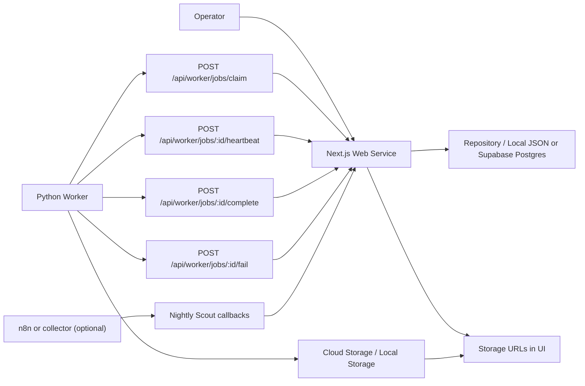

# 03 Architecture Design

## Current Architecture

## Components

### Web Service

The Next.js app is the control plane. It owns settings, queue selection, worker job creation, job status, run logs, and manual review.

### Repository Layer

The Web Service uses a repository adapter behind one TypeScript contract.

- `local-json` remains the default development adapter.
- `supabase` stores the same control-room data in Supabase/Postgres for shared cloud operation.
- Select with `AUTOMATION_REPOSITORY_ADAPTER=supabase` or the legacy-compatible `AUTOMATION_STORAGE_ADAPTER=supabase`.
- The Supabase service role key is used only by server modules and API routes. Client components must never import it or display it.
- Python Worker continues to poll the WebApp API; it does not read or write Supabase directly.

### Production Planner

The planner is a WebApp-side planning layer that reads `product_candidates`, static event seeds, channel profiles, and production history to produce a daily shortlist. It never creates worker jobs. The expected path remains:

1. Manual Coupang input or collector/CSV import creates `product_candidates`.
2. Operator reviews image, affiliate, duplicate, and score readiness and promotes a candidate to `product_queue`.
3. Operator generates a content draft for the queue item.
4. `/api/run/next-batch` creates `worker_jobs` only for items that pass guards.
5. Python Worker renders video and uploads artifacts.

Event calendar and channel profile tables are provided by `supabase/migrations/003_event_calendar_and_planner.sql` for future persisted planner state. The first implementation uses static event/channel foundations and computed daily plans.

The MVP product input path is intentionally in-house and WebApp-driven. `/api/candidates/import-coupang` normalizes a manually pasted Coupang product URL, validates the optional affiliate short link, validates product image readiness, and upserts a candidate only. It does not expand n8n, Creatomate, Google Docs, platform uploads, queue rows, or worker jobs.

n8n, Creatomate, and Google Docs are not the current production path. Naver BrandConnect is deferred. multi-user SaaS is deferred. Keep those items as roadmap/design work until the in-house Coupang MVP path is stable in production.

### Python Worker

The Python Worker is not a web service. It polls the web service, claims work, sends heartbeats, uploads artifacts, and reports results. It handles only:

- `video_render`
- `sheet_sync`

`video_render` requires a real product image URL in the job payload. The worker downloads the image with bounded network checks and fails or retries safely if the image is missing, not an image, empty, or not reachable. It must not complete the job, upload fake artifacts, or move a queue item to `video_ready` when image download or ffmpeg rendering fails.

### Storage

Generated artifacts are uploaded to storage and represented in the web app by URLs:

- MP4: `rendered-videos`
- thumbnails: `thumbnails`
- SRT: `subtitles`
- sheet exports: `sheet-exports`
- upload package text: `upload-packages`
- product images: `product-images`

For local worker runs, use `STORAGE_BACKEND=local`, `LOCAL_STORAGE_BASE_DIR`, and `STORAGE_LOCAL_BASE_URL` or the existing `PUBLIC_STORAGE_BASE_URL` compatibility variable.

Repository storage and artifact storage remain separate concerns. The WebApp stores artifact URLs in queue fields and `product_assets`; the Python Worker uploads files through local, Supabase Storage, R2, or another S3-compatible backend and reports the returned URLs through WebApp APIs.

### Legacy n8n

n8n workflow files remain for legacy/reference use. Nightly Scout may still use n8n or a separate product collector. Next-batch video rendering now uses worker jobs.

## Failure Philosophy

Completion means usable output exists. A worker that cannot produce `video_url` must fail or retry, not report success.

## Content AI Provider Scaffold

Content generation now routes through a provider interface with `template`, `openai`, `gemini`, and `disabled` provider names. The safe default is `template`. OpenAI/Gemini are readiness scaffolds in this PR; live external calls remain disabled and missing keys or provider failures fall back to template output.

The WebApp generates content drafts through `POST /api/queue/[id]/generate-content`. That route never creates `worker_jobs`. `/api/run/next-batch` remains the only path that creates worker jobs.
