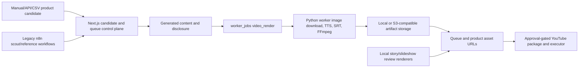

# Current Coupang SNS System Audit

## Executive Summary

Audit date: 2026-07-12 KST. Canonical repository: `mizzang0305-oss/commerce-automation` at base commit `beaa2e482ae287832c654cba8e82c8f184f25ec1`.

The verified control path is a Next.js operations service backed by local JSON or a server-only Supabase repository adapter. It creates `worker_jobs`; a Python worker claims `video_render` jobs, downloads a product image, creates narration/subtitles, renders a vertical FFmpeg video, uploads artifacts, and reports completion. Several local review renderers and approval-gated YouTube modules coexist with this path. That fragmentation is the main migration risk.

The migration must preserve product sourcing, content/disclosure generation, queue state, upload readiness, duplicate guards, OAuth, and result evidence. Only the renderer boundary is added. The default remains legacy and all new outputs are non-publishable.

## As-Is Architecture

## Verified Processing Stages

1. Product input: manual Coupang import, CSV, collector/event candidate flows, and server-only Partners resolver modules exist. Candidate import does not create uploads.
2. Product data: candidate and queue records include product identity, affiliate evidence, image evidence, ranking/readiness state, and channel key.
3. Content: generated content stores title, script, captions, hashtags, platform copy, CTA, and Coupang Partners disclosure.
4. Assets: product images are downloaded or resolved, validated, and represented in `product_assets` or local protected review folders.
5. Rendering: the Python worker is the documented batch path; local story/slideshow/review renderers support approval workflows.
6. Upload: V074-V115 YouTube contracts implement readiness, approval, private/public execution boundaries, comment gates, duplicate checks, evidence storage, and redaction.
7. Storage: repository state and artifact storage are separate. Local storage, R2, Supabase Storage, or another S3-compatible backend can hold artifacts.
8. Operation: `/api/run/next-batch` is the worker-job entry point. n8n is legacy/optional and not the documented next-batch render path.

## Main Technologies

- Next.js and strict TypeScript control plane.
- Vitest, ESLint, Zod, and package scripts for validation.
- Python worker with FFmpeg/FFprobe, Pillow/TTS/subtitle helpers.
- Local JSON or server-only Supabase repository adapter.
- Local or S3-compatible artifact storage.
- Approval-gated YouTube Data API adapters.

## Video Modules

- `python-worker/src/tasks/video_render.py`: worker orchestration and storage reporting.
- `python-worker/src/media/video_renderer.py`: 1080x1920 FFmpeg renderer and subtitle safe area.
- `src/lib/uploads/videoAssets/oneProductLocalVideoGenerator.ts`: local story renderer and media evidence.
- `src/lib/local-slideshow-execution/`: approved local FFmpeg/MoviePy slideshow execution.
- `src/lib/slideshow-package/`: no-execution slideshow planning and command previews.
- `scripts/uploads/generate-v0*.ts`: historical review packet generators.

## SNS and Upload Modules

- `src/uploads/youtube/v074*`: public upload scaffold and safety gates.
- `src/uploads/youtube/v075*`: comment package/writer gates.
- `src/uploads/youtube/v076UploadResultStore.ts`: sanitized upload-result evidence.
- `src/uploads/youtube/v081*` through `v115*`: controlled private/public execution readiness, server-only adapters, package binding, and local/R2 asset bridges.
- `scripts/uploads/run-v110-v057-private-upload-one-shot.ts`: explicit one-shot server entry point.

Instagram and TikTok copy/planning fields exist, but a verified production upload implementation was not established during this audit. They remain `UNKNOWN_NOT_TESTED` rather than supported.

## Data and Queue Structure

The control plane uses repository contracts for `product_candidates`, `product_queue`, `generated_contents`, `worker_jobs`, `automation_runs`, `product_assets`, and channel upload packages. Local JSON is the development default. Supabase uses server-only credentials and additive migrations; no migration or DB write was performed by this work.

## Failure and Cost Risks

- Multiple renderer generations make ownership and rollback difficult.
- Historical source files contain mojibake risk and must not be reused blindly for Korean text.
- Render output contracts differ between worker URLs, local paths, and prepared HTTPS assets.
- FFmpeg and TTS subprocesses need strict timeouts and orphan cleanup.
- Existing upload code has a large safety surface; rewriting it would increase regression risk.
- Remote image, TTS, storage, and platform calls can introduce cost and non-determinism.

## Security and Compliance Risks

- OAuth, Coupang, Supabase, R2, and worker secrets are server-only and must not enter render manifests.
- Affiliate URLs and raw product URLs require redaction in diagnostics.
- Disclosure, product-data freshness, stock, price, and unsupported claims must remain publish blockers.
- Image usage rights depend on the existing product-source agreement and were not independently proven here.

## Keep, Replace, and Unknown

Keep: product sourcing, queue state, content/disclosure, storage contracts, upload readiness, OAuth, duplicate guard, and result evidence.

Wrap: current renderers behind a common contract.

Add: photo-to-short normalization, video-use adapter, media quality evidence, shadow comparison, and immediate legacy fallback.

Do not remove: any legacy renderer, upload adapter, scheduler, or database field during Stage 0-2.

Unknown/not tested: production scheduler host, Instagram/TikTok live upload support, production storage credentials, production DB state, and real product image license terms.
