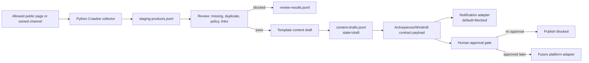

# Crawlee + Activepieces/Windmill commerce automation PoC

## 0) Intent

Provide a fail-closed local PoC for product collection, quality review, content drafting, orchestration handoff, and notifications without installing Activepieces/Windmill or publishing to external platforms.

## 1) Repository fit

- Web/control plane: Next.js and TypeScript.
- Heavy/background work: separate Python Worker.
- Collector foundation: optional Python dependencies in `python-worker/requirements-collector.txt`.
- Development persistence: local JSON under `data/`; production persistence can use the existing Supabase repository adapter.
- Queue boundary: collectors must not create `product_queue` or `worker_jobs`.
- Content boundary: template generation is local and draft-first.
- Publish boundary: current settings keep `run_mode=generate_only`, `approval_required=true`, and public upload disabled.

This PoC follows those boundaries by using append-only JSONL under ignored `data/commerce-poc/`. A later production change may add dedicated Supabase staging tables after a reviewed migration.

## 2) Automation flow



## 3) Collector contract

Each JSONL record contains:

- `product_name`
- `price` (`number | null`)
- `image_url`
- `stock_status` (`in_stock | out_of_stock | unknown`)
- `seller`
- `collected_at`
- `source_url`
- `raw_hash` (SHA-256 of normalized collected fields)

Safety rules:

- a non-empty exact host allowlist is mandatory;
- authorization basis must be `public_page` or `owned_channel`;
- only caller-supplied URLs are crawled;
- redirects are not followed, and any final response URL is revalidated as defense in depth;
- URLs containing embedded credentials are rejected;
- discovered links are not enqueued;
- robots.txt is respected;
- retry-on-blocked is disabled;
- price text with multiple currency amounts is treated as missing instead of guessing a list or sale price;
- spaced, punctuated, zero-quantity, and common English negative stock labels are normalized before positive stock matching;
- no login, CAPTCHA bypass, proxy evasion, review-text copying, or protected endpoint access.

## 4) Review rules

The TypeScript review stage blocks drafts for:

- missing price;
- missing product name;
- missing or invalid image URL;
- duplicate `raw_hash` or normalized seller/product pair within the batch or prior local staging;
- configured forbidden words;
- configured exaggeration terms;
- invalid original link;
- original-link host outside the source allowlist.

Default forbidden/exaggeration terms are intentionally small and must be replaced with an owner-reviewed policy list before production.

## 5) Draft and publish boundary

Only review-passed products receive a template draft. Every draft has:

- `state=draft`;
- `approval_required=true`;
- `publish_allowed=false`.

`evaluatePublishApproval` can validate a future approval record, but it still returns `publish_allowed=false` with `PUBLISH_EXECUTOR_NOT_IMPLEMENTED`. This PoC contains no publisher or upload executor. A production implementation must authenticate the approver, make approvals single-use, persist an audit log, and separately enable a reviewed publisher before a publish decision can become true.

## 6) Activepieces/Windmill contract

`buildCommerceOrchestratorPayload` supports `target=activepieces|windmill` and always emits:

- `dispatch_mode=contract_only`;
- aggregate review/draft counts;
- draft identifiers and source links;
- `webhook_called=false`;
- `notification_sent=false`;
- `platform_upload_attempted=false`;
- `publish_allowed=false`.

The callback schema requires `publish_requested=false`. No webhook URL or secret is placed in the payload.

Local JSONL processing command:

```powershell
npm run automation:commerce-poc:jsonl -- --input=data/input/products.jsonl --allowed-host=shop.example --target=activepieces
```

The command only reads local JSONL and writes local staging/review/draft JSONL. It does not call Activepieces, Windmill, Novu, Supabase, R2, SNS, or shopping platforms.

The local run ID is a deterministic hash of the input JSONL, normalized allowed host, and orchestrator target. Retrying the same command reuses the same batch. Existing review/draft timestamps are reused when the stable record content matches, while changed input under the same batch fails closed.

## 7) Local scheduler, retry log, and draft queue

The local-only scheduler wraps the existing deterministic JSONL command without adding a daemon, webhook, database, or external orchestrator dependency:

```powershell
npm run automation:commerce-poc:schedule -- --input=data/commerce-poc/activepieces-input.jsonl --allowed-host=shop.example --target=activepieces
```

Optional arguments are `--scheduled-at=<ISO datetime>`, `--max-attempts=1..5`, and `--retry-delay-ms=0..86400000`. A future `scheduled-at` value records `scheduled` and exits without running the pipeline. A due item records append-only transitions in `data/commerce-poc/scheduler-status.jsonl`. Local failures move to `retry_wait` and retry only up to the configured bound. An interrupted `running` state is also counted as a failed attempt before recovery. Only a successful local run can add idempotent entries to `data/commerce-poc/draft-queue.jsonl`.

The scheduler holds one local filesystem lock across state inspection, pipeline execution, and draft enqueue. A concurrent caller fails closed with `LOCAL_SCHEDULER_ALREADY_RUNNING`; it does not execute or enqueue. A lock owned by a process that no longer exists is reclaimed on the next invocation. Because the JSONL status and draft files are shared, the lock is intentionally global rather than per schedule.

`retry_wait` represents a failed attempt and returns `ok=false`; the CLI exits nonzero so a caller cannot mistake it for completed work. The persisted `next_run_at` still prevents an early invocation from executing before the delay expires.

After a schedule exhausts `max-attempts`, it remains terminal until the owner explicitly supplies the exact local retry approval:

```powershell
npm run automation:commerce-poc:schedule -- --input=data/commerce-poc/activepieces-input.jsonl --allowed-host=shop.example --target=activepieces --retry-failed=APPROVE_LOCAL_FAILED_SCHEDULE_RETRY
```

The approval is accepted only when the current schedule state is `failed`. It appends an audited `operator_action=retry_failed`, increments `retry_generation`, resets the per-generation attempt counter, and is consumed once. It does not authorize crawl, webhook, notification, database, queue, worker, or upload actions.

Draft queue entries contain only identifiers, target, review state, and approval flags. They always use `state=draft_pending_review`, `approval_required=true`, and `publish_allowed=false`. Failure logs store the fixed code `LOCAL_EXECUTION_FAILED` instead of raw exception text. Every scheduler status explicitly records external call, webhook, notification, platform upload, database, product queue, and worker job side effects as false.

This is an invocation seam, not an operating-system service. Windows Task Scheduler, a process supervisor, Activepieces, or Windmill may call the command later only under a separate configuration approval. The repository does not install or modify any host scheduler.

## 8) Notification adapter

`CommerceNotificationAdapter` is the extension point for Novu or the existing notification structure. The default `BlockedCommerceNotificationAdapter` always returns `NOTIFICATION_ADAPTER_NOT_CONFIGURED` and performs no network request.

## 9) Proposed future environment variables and keys

No API key is required for fixture tests or contract-only execution.

| Future integration | Proposed server-only configuration | Required now |
| --- | --- | --- |
| Activepieces | `ACTIVEPIECES_WEBHOOK_URL`, `ACTIVEPIECES_WEBHOOK_SECRET` | No |
| Windmill | `WINDMILL_BASE_URL`, `WINDMILL_WORKSPACE`, `WINDMILL_TOKEN` | No |
| Novu | `NOVU_SECRET_KEY`, subscriber/topic identifiers | No |
| Owned-channel collector | channel-specific API token or approved session mechanism | No |
| External AI draft provider | existing `OPENAI_API_KEY` or `GEMINI_API_KEY` | No; template only |
| SNS/shopping publish | platform OAuth/client credentials | No; publisher absent |

Never expose these as `NEXT_PUBLIC_*`, store them in JSONL, or send them in webhook bodies.

## 10) Deployment sequence

1. Owner approves source hosts, authorization basis, forbidden words, and exaggeration policy.
2. Install `requirements-collector.txt` in an isolated non-production collector runtime.
3. Run fixture tests, then a named non-production/owned-page smoke with a strict request cap.
4. Review JSONL evidence and retention needs.
5. Choose Activepieces or Windmill and add one authenticated server-side webhook adapter with HMAC/replay protection.
6. Add a Novu/existing notification adapter behind an enable flag.
7. If shared persistence is required, add reviewed Supabase staging/draft/audit tables and RLS/migration rollback.
8. Add authenticated single-use approval records and audit logs.
9. Connect one sandbox/private platform adapter only after a separate execution approval.

## 11) Rollback

Remove the PoC modules, tests, script, fixture, and documentation. Delete local ignored `data/commerce-poc/` artifacts if the owner requests it. No production database, webhook, notification, queue, upload, or deployment rollback is required because this PoC performs none of those actions.
